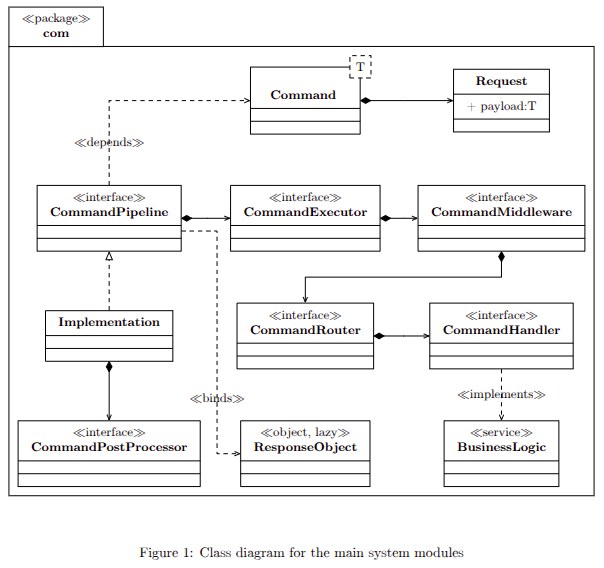

# Summary

In modern enterprise systems, the complexity of command processing often
leads to challenges in scalability, maintainability, and performance.
Traditional implementations of Command Query Responsibility Segregation
(CQRS) \[@Betts\] and event-driven architectures frequently intertwine
business logic with cross-cutting concerns such as logging, retry
mechanisms, and audit propagation. This entanglement results in tightly
coupled components, making systems brittle and difficult to evolve. As
systems scale, the need for a more modular and adaptable approach
becomes evident.

The motivation for this work stems from the necessity to decouple
operational concerns from core business logic. Drawing inspiration from
classical design patterns such as the *Chain of Responsibility* and
*Strategy*, as well as modern declarative paradigms, we propose a
framework \[@MartinFowler\] —**Extensible Orchestrated Interceptor
Workflows (EOIW)**—that facilitates the construction of
high-performance, maintainable, and resilient command processing
pipelines. EOIW models command execution as a functional pipeline
$`\mathcal{P}`$, where each stage $`s \in S`$ (e.g., routing, middleware
invocation, handler execution, post-processing) is orchestrated through
dynamically extensible interceptor chains $`I`$. The framework aims to
provide predictable latency, high throughput, and strong type safety
\[@Leinberger\], all while ensuring idempotency guarantees.

This paper focuses on the command side of CQRS, specifically addressing
synchronous/asynchronous/disruptor processing, middleware orchestration,
routing, and handler execution. By abstracting execution concerns and
enabling dynamic extension of interceptor chains, our approach ensures
cleaner separation of responsibilities and better runtime adaptability.
The scope is confined to command-side processing, leaving the query side
for future exploration \[@Ramamoorthy\].

## Statement of Need

Command processing in modern enterprise systems, particularly in CQRS
architectures, often suffers from complexity, latency, and
maintainability issues. Traditional implementations tend to muddle
business logic with cross-cutting concerns such as logging, retry
handling, and audit propagation. This tight coupling makes pipelines
brittle and difficult to evolve as the system scales. Formally, let a
command pipeline be represented as
$`\mathcal{P} = \{s_1, s_2, \dots, s_n\}`$, where $`s_i \in S`$ denotes
a stage of execution. Without proper abstraction, each $`s_i`$ mixes
business logic $`B(s_i)`$ with operational concerns $`O(s_i)`$, leading
to high coupling and reduced maintainability \[@Dehury\]:
``` math
\begin{equation}
    s_i = B(s_i) + O(s_i), \quad \forall i = 1, \dots, n
\end{equation}
```

## Motivation

There is a clear need for scalable, reliable, and pattern-driven designs
that allow for modular, high-performance command processing. By
decoupling operational concerns from business logic and leveraging
classical design patterns (e.g., Chain of Responsibility, Strategy,
Template Method) \[@Gamma\] along with modern declarative and functional
paradigms, systems can achieve predictable latency, strong type safety,
and idempotency guarantees. EOIW introduces a separation such that:
``` math
\begin{equation}
s_i = B(s_i), \quad I_i = O(s_i), \quad \forall i
\end{equation}
```
where $`I_i`$ represents the interceptor chain handling operational
concerns independently of business logic \[@Patwardhan\].

## Scope

This work focuses on the command side of CQRS pipelines (excluding
query-side concerns). Specifically, it addresses synchronous,
asynchronous, disruptor processing, middleware orchestration, routing
and handler execution. The proposed framework abstracts execution
concerns from business logic, enabling clean separation of
responsibilities and dynamic extension of command workflows.

### Contributions

The paper makes several key contributions:

- Introduction of **Extensible Orchestrated Interceptor Workflows
  (EOIW)**, a composable and maintainable architecture for command
  processing pipelines.

- Systematic mapping of classical design patterns to CQRS command
  pipelines, highlighting performance and maintainability trade-offs.

- Formal temporal model $`\tau`$ for command execution and
  post-processing, ensuring deterministic ordering and resilience
  semantics under transient system failures.

- Practical implementation using Jersey(JAX-RS) Spring Boot and
  high-performance command queues, demonstrating measurable improvements
  in throughput and latency over conventional synchronous CQRS handlers.

# Background and Related Work

## Command Query Responsibility Segregation (CQRS)

Command Query Responsibility Segregation (CQRS) is an architectural
pattern that separates the handling of data modification (commands) from
data retrieval (queries) within an application. This segregation allows
for optimization of each operation independently, leading to improved
scalability, performance, and maintainability. The CQRS pattern is
particularly beneficial in scenarios where read and write operations
have distinct performance, scalability, or security requirements.

In traditional CRUD (Create, Read, Update, Delete) architectures, a
single data model is often used for both reading and writing operations.
However, as applications scale, this approach can lead to challenges
such as data mismatch, lock contention, and performance bottlenecks. By
adopting CQRS, these issues can be mitigated, as the read and write
models can be optimized separately to meet their specific needs.

Despite its advantages, implementing CQRS introduces complexity,
especially in maintaining consistency between the command and query
models. Techniques like eventual consistency or two-phase commit are
often employed to address these challenges.

## Event-Driven Architecture (EDA)

Event-Driven Architecture (EDA) is a design paradigm where system
components communicate through the production, detection, and reaction
to events. This approach enables decoupled, asynchronous communication
between components, facilitating scalability and responsiveness in
distributed systems \[@MarkRichards\].

In the context of CQRS, EDA plays a crucial role by enabling the
decoupling of command processing from query handling. Events generated
by command handlers can be asynchronously processed by other components,
allowing for real-time updates to the query models. This decoupling
enhances system flexibility and scalability, as components can evolve
independently without affecting the overall system.

However, EDA introduces challenges related to event ordering, message
delivery guarantees, and system observability. These challenges
necessitate the design of robust event processing mechanisms to ensure
system reliability and maintainability.

## Middleware and Interceptor Patterns

Middleware and interceptor patterns are design strategies that allow for
the insertion of additional processing logic into the execution flow of
an application. These patterns enable the separation of cross-cutting
concerns such as logging, authentication, and error handling from the
core business logic, promoting cleaner and more maintainable codebases.

In the context of CQRS and EDA, middleware and interceptors can be
utilized to manage concerns like retry mechanisms, resilience, logging,
and audit propagation. By abstracting these concerns into separate
components, the core business logic remains focused and decoupled from
operational concerns, facilitating easier maintenance and evolution of
the system.

## Temporal Models and Deterministic Execution

Ensuring deterministic execution and predictable latency is critical in
high-performance systems. Temporal models provide a framework for
reasoning about the timing and ordering of events within a system,
enabling the design of systems that exhibit predictable behavior even
under varying load conditions.

In the context of command processing pipelines, temporal models can be
employed to define the sequencing and timing constraints of command
execution and post-processing stages. This approach ensures that
commands are processed in a consistent and predictable manner,
facilitating the design of resilient systems \[@Schagaev\] that can
gracefully handle transient failures and maintain system stability.

# Functional Composition of the Command Pipeline

## Formal Definitions

Let:

- $`C`$ — the set of all **commands**.

- $`R`$ — the set of all **results**.

- $`E`$ — the set of all **exceptions**.

- $`\mathcal{S}`$ — the set of all **suppliers**, where
  $`s \in \mathcal{S}`$ is a function $`s: \varnothing \to R \cup E`$.

## Core Mappings

``` math
\begin{aligned}
\text{route} &: C \to H && \text{(selects the appropriate handler)} \\
\text{handle}_h &: C \to R \cup E && \text{(handler processes the command)} \\
\text{exec} &: C \to \mathcal{S} && \text{(executor creates deferred computation)} \\
\text{pre}_m &: C \to C && \text{(middleware transformation)} \\
\text{post}_p &: C \times (R \cup \{\bot\}) \times (E \cup \{\bot\}) \to (R \cup \{\bot\}) \times (E \cup \{\bot\}) && \text{(post-processor)}
\end{aligned}
```

## Composed Pipeline Function

``` math
\begin{equation}
\mathrm{pipeline} = \mathrm{wrapPost} \circ \mathrm{exec}
\end{equation}
```

For a command $`c \in C`$:
``` math
\begin{equation}
s = \mathrm{exec}(c)
\end{equation}
```
and
``` math
\begin{equation}
\mathrm{wrapPost}(s)() =
\mathrm{finalize}\big(
    \mathrm{fold}_{p \in P}(\mathrm{post}_p,\, \mathrm{tryExec}(s))
\big)
\end{equation}
```

## Execution Semantics

``` math
\begin{equation}
\mathrm{tryExec}(s) =
\begin{cases}
    (s(), \bot) & \text{if handler succeeds}\\[4pt]
    (\bot, e) & \text{if handler throws exception } e
\end{cases}
\end{equation}
```

## Temporal Property

A more precise formulation of the temporal property, separating
orchestration from execution, is:
``` math
\begin{align}
\forall c \in C,\, \exists! r \in R, e \in E : \quad
& \underbrace{\mathrm{pre}_{m_1} \circ \dots \circ \mathrm{pre}_{m_n}}_{\text{middleware orchestration}}(c) \notag\\
& \;\to\; 
\underbrace{\mathrm{exec}_h(c)}_{\text{command execution}} \notag\\
& \;\to\; 
\underbrace{\mathrm{post}_{p_1} \circ \dots \circ \mathrm{post}_{p_m}}_{\text{post-processing orchestration}}(c,r,e)
\end{align}
```

Where:

- $`\mathrm{pre}_{m_i}`$ - middleware transformation and side-effects
  (validation, logging, etc.) before command execution.

- $`\mathrm{exec}_h`$ - the actual handler invocation performing the
  command’s business logic, producing $`r \in R`$ or $`e \in E`$.

- $`\mathrm{post}_{p_j}`$ - post-processors applied sequentially after
  successful or failed execution for auditing, retries, notifications,
  etc.

This separation makes it explicit that **pipeline orchestration
(middleware and post-processing sequencing) is distinct from the core
command execution**, even though the temporal property ensures
deterministic and traceable sequencing across the full lifecycle.

#### Resilience Extension.

In the presence of systemic failures (e.g., transient network or
database unavailability), the temporal property is extended with
fallback semantics. If $`\mathrm{exec}(c)`$ cannot complete
successfully, a resilience mechanism (such as Resilience4J retries)
attempts recovery:
``` math
\begin{equation}
\forall c \in C,\ \exists! p \in P :
\big(
    \mathrm{exec}(c) \prec \mathrm{post}_p(c,r,e)
\big)
\ \lor\
\big(
    \mathrm{fail}(c) \Rightarrow \Diamond\, \mathrm{retry}(c)
\big)
\end{equation}
```

If recovery eventually fails, the system propagates an explicit
exception, preserving state consistency and traceability throughout the
command lifecycle.

# Command Processing Infrastructure

## Class Diagram

<figure id="fig:class-diagram-main" data-latex-placement="H">
<figure data-latex-placement="H">
<div class="center">

## Architecture

While the UML diagrams \[@Hofmeister\] illustrate the structural
composition of command pipelines, it is instructive to consider the
underlying architectural principles that make such designs effective. At
first glance, highly concurrent, low-latency architectures like LMAX
Disruptor \[@Thompson\] may appear suited for niche, high-throughput
applications. However, their design choices reveal broader benefits. By
moving the working set into main memory, adopting a single-threaded,
in-memory event processor, and separating cross-cutting concerns from
core business logic, much of the traditional complexity of enterprise
applications is eliminated. Event sourcing ensures durability without
relying on synchronous database coordination, while structured,
deterministic processing \[@Vukotic\] simplifies error handling and
concurrency management, even when executed in a synchronous pipeline.
\[@Doberkat\]

This architectural philosophy \[@MarkRichards\] resonates with the
command-side of CQRS: operations can be orchestrated through a
synchronous pipeline where middleware, handlers, and post-processors
interact deterministically and efficiently, without being tightly
coupled to the underlying infrastructure. It encourages clearer
separation of responsibilities, type safey, facilitates maintainable
code, and provides predictable performance. In essence, modern
enterprise systems can borrow these principles \[@Fowler\] to achieve
high throughput, resilience, and simplicity while relying on synchronous
execution.

# Best Practices

High-performance command processing pipelines require disciplined
architectural practices to ensure maintainability, resilience, and
predictable throughput. Based on the principles of Extensible
Orchestrated Interceptor Workflows (EOIW), the following best practices
are recommended:

## Consistent Use of the Command Pattern

The Command pattern encapsulates a request as an object, separating the
responsibility of issuing a command from the execution logic. Using the
Command pattern consistently across all operations ensures:

- **Decoupling of senders and receivers:** Pipeline orchestration stages
  can operate independently without tight coupling to business logic.

- **Enhanced testability:** Each command can be independently tested,
  mocked, or replayed.

- **Support for cross-cutting concerns:** Features such as logging,
  auditing, retries, and undo functionality can be applied uniformly
  across all commands without modifying core business logic.

Standardizing command representation ensures that interceptor chains and
orchestration layers can process all commands uniformly, improving
composability and predictability \[@Gamma\].

## Lightweight and Composable Middleware

Middleware in command pipelines should be small, modular, and
composable, avoiding heavy monolithic components. This enables:

- **Dynamic orchestration:** Interceptor chains can be extended or
  reordered without affecting other components.

- **Independent evolution:** Middleware handling logging, retry, or
  security can evolve separately from the command handlers.

- **Minimal performance overhead:** Lightweight middleware ensures that
  cross-cutting concerns do not introduce latency bottlenecks.

Examples include logging interceptors, audit propagators, and resilience
wrappers. Composability ensures that these components can be reused
across pipelines and dynamically injected into the workflow
\[@MartinFowler\].

## High-Throughput Event-Driven Infrastructure

For high-performance command processing, adopting event-driven
infrastructures such as LMAX Disruptor or equivalent low-latency message
queues provides:

- **Lock-free inter-thread communication:** Minimizes contention in
  high-throughput systems.

- **Deterministic latency:** Consistent timing ensures commands are
  processed predictably.

- **Backpressure handling:** Event-driven frameworks allow the system to
  gracefully handle surges in command volume.

EOIW leverages these mechanisms to orchestrate commands efficiently,
ensuring that high volumes of requests are processed without bottlenecks
\[@Thompson\].

## Standardized Command Execution

Applying Strategy or Template Method patterns for command execution
provides a consistent framework for handling:

- **Retries and failure handling:** Retry policies and exception
  management can be standardized across commands.

- **Pre- and post-processing:** Hooks for validation, logging, or
  notifications can be applied consistently.

- **Customizable behavior:** Specific business logic variations can be
  implemented by extending templates or strategies without altering the
  pipeline core.

This pattern-based approach ensures maintainable, predictable, and
extensible execution flows \[@Gamma\].

## Monitoring, Observability, and Exception Handling

Continuous monitoring of command pipelines is essential to maintain
performance and reliability:

- **Performance metrics:** Track throughput, latency, and queue length
  at each pipeline stage.

- **Exception logging and handling:** Centralized logging of errors and
  propagation policies prevent silent failures.

- **Observability:** Distributed tracing and audit logs ensure
  visibility into command execution sequences and bottlenecks.

By instrumenting interceptor chains and middleware, EOIW provides
comprehensive insights into operational behavior, facilitating proactive
maintenance and optimization \[@Liu\].

# Conclusion

In this work, we presented **Extensible Orchestrated Interceptor
Workflows (EOIW)**, a framework designed to address the performance,
maintainability, and resiliency challenges inherent in command-driven
enterprise systems. The key contributions of this study are threefold:

1.  **Pattern Mapping for Command Pipelines:** By systematically
    applying classical design patterns such as Chain of Responsibility,
    Strategy, and Template Method to command processing workflows, we
    demonstrate how these established techniques can be leveraged to
    improve modularity, extensibility, and predictability of command
    execution. This mapping provides practitioners with concrete
    guidelines for integrating pattern-based design in modern CQRS
    pipelines \[@Gamma\].

2.  **Analysis of Performance and Maintainability Trade-offs:** EOIW
    provides a structured approach for decoupling operational
    concerns—such as retry handling, logging, audit propagation, and
    exception management—from business logic. Our analysis highlights
    the trade-offs between achieving low-latency, high-throughput
    command execution and maintaining clean, extensible architecture.
    The framework emphasizes lightweight, composable middleware and
    high-performance event-driven infrastructures, ensuring both
    operational efficiency and maintainability.

3.  **Practical Implementation Guide:** The framework is validated
    through an implementation leveraging Spring Boot and a
    high-throughput command queue, illustrating concrete techniques to
    orchestrate command execution with deterministic temporal behavior.
    The implementation demonstrates measurable improvements in
    throughput and latency compared to conventional synchronous CQRS
    handlers, providing a practical reference for developers aiming to
    deploy EOIW in enterprise environments \[@Fineract\].

Overall, EOIW advances the state of the art by offering a unified
methodology that integrates classical and modern design paradigms,
enabling developers to construct robust, high-performance command
processing pipelines while preserving system flexibility and
observability.

[^1]: Email: kapil.panchal.development@gmail.com
